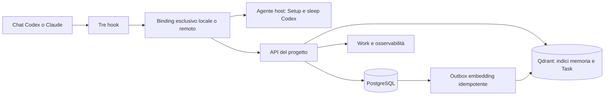

[EN · English](architecture.md) · [**IT · Italiano**](architecture.it.md)

# Architettura

Riferimento tecnico per `v0.2.0-beta.1`.

dDuo Solo Founder è una memoria operativa isolata per progetto, condivisa tra
Codex e Claude Code. Può risiedere sul computer o su una VPS autenticata; la
UI rimane contenuta, mentre i dati sono durevoli e verificabili.

<a id="beta-package-architecture"></a>
## Architettura del pacchetto Beta

```text
Nucleo portabile Agent Plugins: plugin.json + skills/ + mcp.json
                              |
Runtime condiviso: MCP + API + PostgreSQL + Qdrant + dashboard + backup
                              |
               Adattatore Codex + adattatore Claude
```

Agent Plugins 1.0 standardizza Skill e discovery MCP, non gli hook necessari
a registrare turni e iniettare contesto. Codex e Claude Code sono i client
supportati; identità MCP non supportate o incongruenti vengono rifiutate.

I sorgenti nativi sono in `it.dduo.client-support/`. L'installer crea un
pacchetto minimo per client: Codex riceve manifest, Skill, hook e licenza;
Claude riceve manifest, Skill, launcher MCP e licenza. La radice portabile
non viene registrata due volte. Codex usa il dispatcher assoluto verificato;
ogni chiamata MCP continua a validare il proprio `workspace_root`.

`PLUGIN_ROOT` individua le risorse distribuite. `PLUGIN_DATA` appartiene
all'installazione client e può sparire alla disinstallazione: non conserva
memoria o credenziali autorevoli. I dati restano nello stack collegato e nelle
directory host private del progetto, condivisi fra i client supportati.



<a id="host-control-plane"></a>
## Controllo dell'host

`dduo-agent` è un processo persistente locale all'host. Token privato e lock
all'avvio impediscono istanze concorrenti. Seleziona una porta libera, la salva
con permessi `0600` e la passa all'ambiente Docker di ogni progetto. Accetta
richieste solo da loopback o rete privata dei container, sempre con bearer
autorizzato. Il gateway pubblico non espone questa porta.

L'agente gestisce solo funzioni dell'host: chiamate seriali alla CLI in
abbonamento, Setup, accessi nativi, chiavi OpenAI e credenziali Codex su file
isolate per progetto, ripresa dei job sospesi per autenticazione. Docker riceve
il token dell'agente host, mai la credenziale dell'abbonamento.

Sleep usa `gpt-5.6-terra` con ragionamento medio. Nell'esecuzione effimera sono
disabilitati shell/exec e ricerca web: il modello riceve input limitato e schema
strutturato, senza strumenti per leggere il file di accesso usato dal processo
Codex stesso.

<a id="project-boundary"></a>
## Confine di progetto

Ogni cartella collega un UUID in `.dduo-solo-founder/project.toml`. Il
collegamento locale registra le porte API/Web; quello remoto registra endpoint
HTTPS. Il progetto Compose sull'host autorevole possiede volumi PostgreSQL e
Qdrant isolati. Ogni operazione API è limitata all'UUID: il recupero non attraversa
i confini dei progetti. La prima autorità di un progetto nuovo può nascere
direttamente su una VPS Linux, seguita da `remote-bind` sul computer. Un'autorità
già esistente si sposta con il protocollo di trasferimento.

La radice canonica fa parte della rivendicazione dell'autorità locale. Prima
di modificare lo stato, i comandi verificano proprietario e radice registrati.
Copiare un descrittore configurato in un'altra cartella non crea una seconda
memoria scrivibile: serve uno spostamento, ripristino o ricollegamento esplicito.

Anche su VPS ogni progetto ha uno stack Compose completo. Più stack possono
convivere sul server; l'unico container condiviso è Caddy sulla rete dell'host.
Caddy termina TLS ACME di breve durata sull'IP pubblico e inoltra la porta
HTTPS assegnata al progetto verso la sua porta Web, esposta solo su loopback.
Il servizio Web inoltra `/api` alla propria API privata. Il primo progetto usa
443; i successivi ricevono una porta libera stabile tra 24443 e 25442.
PostgreSQL, Qdrant, API, worker, Web, segreti e backup restano separati.

Il descrittore dichiara esattamente un collegamento: `local` contiene solo
porte loopback; `remote` contiene URL HTTPS canonici di API e dashboard e non
può contenere porte locali. Il client remoto deve approvare l'esatta radice del
repository, l'ID di progetto e l'impronta dell'endpoint. Il bearer vive in un
file `0600` separato. Una richiesta remota fallita non avvia né interroga uno
stack locale di riserva, evitando una seconda autorità accidentale.

PostgreSQL è autorevole e conserva profilo e revisioni, Work, Sprint e snapshot
immutabili delle chiusure, artefatti, eventi grezzi, sessioni, turni, segmenti,
job, memorie e revisioni, attività, identità del team, hash dei token dispositivo,
manuale e revisioni, osservabilità, backup, stato/generazione dell'autorità e
outbox embedding. Qdrant contiene raccolte distinte per memorie e Task, isolate
per progetto, derivate e ricostruibili. Un risultato vettoriale non sostituisce
mai il Task autorevole.

<a id="team-and-authority-boundary"></a>
## Team e autorità

In modalità remota tutte le route, tranne health e due scambi monouso,
richiedono un bearer o una sessione browser specifica del progetto. Un bearer
identifica membro e dispositivo; viene salvato solo il suo hash SHA-256. Un
ticket browser valido cinque minuti viene scambiato con un cookie di sette
giorni, specifico del progetto, `HttpOnly`, `Secure`, `SameSite=Strict`.
Rimuovere un membro revoca tutte le sue credenziali dispositivo e browser.

Le capacità sono **Gestore dell'infrastruttura** e **Membro del progetto**.
Entrambi lavorano sullo stesso stato e possono consultare l'osservabilità del
team. Prima della condivisione, il proprietario locale fidato è gestore. Solo
il proprietario locale o il gestore remoto pubblica il manuale e crea la bozza
di compattazione; inviti, revoche, backup e cambi di autorità remoti sono
riservati al gestore.

L'autorità è una macchina a stati esplicita in PostgreSQL:

```text
sorgente:     active(N)
                -> transfer_pending(N, destinazione, nonce; scritture ordinarie rifiutate)
                -> transferred(N, irreversibile dopo ricevuta destination-ready)

destinazione: ripristino di transfer_pending(N, stessa destinazione e nonce)
                -> ricevuta destination_ready, ancora sola lettura
                -> active(N+1) solo con ricevuta source-finalized

sorgente:     transfer_pending(N) -> active(N) solo annullando prima della finalizzazione
```

Il backup finale v2 contiene stato congelato e generazione. Inizializzazione e
attivazione del nodo richiedono anche il segreto di autorità del progetto, non
fornito ai collaboratori. Le ricevute sono vincolate tramite HMAC a progetto,
nodi sorgente/destinazione, generazione e nonce monouso. La destinazione resta
bloccata fino alla ricevuta source-finalized; la sorgente salva la prova prima
di cancellare i propri volumi isolati, rendendo la pulizia ripetibile dopo
un'interruzione.

Il protocollo presume che entrambi gli host siano controllati dallo stesso
gestore fidato. Il segreto viaggia nel bundle cifrato di ripristino completo:
le ricevute proteggono da sovrapposizioni accidentali, corruzione e abbinamenti
errati, non da falsificazioni di una destinazione ostile che possiede quel
segreto. Un modello con host non fidati richiederebbe firme asimmetriche della
sola sorgente o un coordinatore esterno.

<a id="hooks-and-mcp"></a>
## Hook e MCP

| Hook | Responsabilità |
| --- | --- |
| `SessionStart` | Avvia/riprende servizi, reinvia turni pendenti e carica il briefing. |
| `UserPromptSubmit` | Registra un frammento idempotente, estende un turno guidato e inietta il Founder Brief. |
| `Stop` | Salva frammenti ordinati e risposta finale, prepara l'uso attribuibile o accoda il turno per retry. |

Il runner Node incluso delega allo stesso runtime bloccato di MCP. Un puntatore
privato privo di segreti individua gli eseguibili, inclusi gli entry point
Windows `.exe`; un errore emette JSON valido di fallback. Node deve restare
disponibile al client. Claude fornisce le radici plugin/progetto con il proprio
adapter. Codex richiede almeno 0.150.0 e usa `additionalContextLimit=0`,
lasciando a dDuo il budget; Claude conserva il proprio schema hook.

Problemi di memoria o autenticazione non bloccano il modello. L'adapter
status-line separato di Claude registra uso numerico e conserva l'output
precedente; non blocca prompt o strumenti.

MCP copre briefing, memoria, Work, artefatti, attività e Setup. Ogni chiamata
richiede `workspace_root` assoluto canonico, validato indipendentemente da
`cwd` e chiamate precedenti. Claude fissa quella radice anche nell'ambiente e
rifiuta incongruenze; Codex non imposta una radice statica. Questo metadato
proviene dall'agente fidato: non è un'attestazione immutabile del client né
una barriera contro il modello. Radici registrate, autorizzazione di progetto
e archivi isolati impongono la separazione.

Il briefing automatico è già corrente: `get_project_briefing` lo aggiorna
quando serve. `list_tasks` restituisce schede attive compatte; `get_task`
legge una riga e `search_tasks` cerca prima l'identità esatta, poi la semantica.
`activate_task_context` usa la stessa lettura singola. Risolvere un'ambiguità
con una ricerca, poi riutilizzare lo snapshot scelto.

Il contenuto completo richiede `detail=full`. Le liste usano `limit` (100
predefinito, massimo 200), `offset` e `total`: percorrere tutte le pagine per
un inventario completo. `scope=completed|all`,
`placement=current|backlog|archive|all` e `sprint_id` sono filtri indipendenti.
Le letture esatte restano disponibili. `known_snapshot_hash` può restituire
`unchanged` solo finché il chiamante possiede lo snapshot; dopo compattazione
lo rilegge senza il vecchio hash.

Il manuale operativo versionato è obbligatorio negli snapshot completi, non
ripetuto nei delta invariati. Un estratto iniziale/finale esplicito rimanda a
`get_project_manual` quando necessario. La compattazione riservata al gestore
produce una bozza non pubblicata di massimo 4.000 caratteri, tramite sleep o
fallback deterministico. La pubblicazione da dashboard o
`update_project_manual` richiede richiesta diretta o proposta confermata,
concorrenza ottimistica e idempotenza.

Una risposta remota autenticata può alimentare la cache privata del manuale,
autenticata HMAC e legata a progetto, checkout e bearer esatti. Solo errori di
rete o 5xx consentono questo fallback dichiarato obsoleto, mai problemi di
autorizzazione o client incompatibili. Memorie, Work e autorità sostitutive non
vengono conservati localmente.

<a id="founder-brief-composition"></a>
## Composizione del Founder Brief

SessionStart e UserPromptSubmit usano un compositore deterministico con limite
di 9.000 unità sicure per i client: il maggiore tra punti di codice Unicode
Python e unità UTF-16 JavaScript della stringa finale. Questo comprende anche
emoji e altri caratteri che occupano due unità UTF-16.

SessionStart emette uno snapshot completo ad avvio, clear e compattazione
nativa; alla ripresa emette un delta con baseline affidabile, altrimenti uno
snapshot completo. UserPromptSubmit include memorie pertinenti, modifiche a
fondamenti/Work ed elementi Work richiesti esplicitamente ma non ancora
consegnati. Progetto, manuale, Plan e Task vengono consegnati una volta finché
il contesto vivo li conserva, poi solo quando cambiano.

Una baseline privata versionata per sessione registra solo quanto realmente
emesso. Stato assente, corrotto, incompatibile o sessione sconosciuta provoca
uno snapshot completo. La baseline avanza solo dopo il flush dell'output hook,
senza dipendere dalla cache del provider. La compattazione nativa può richiamare
SessionStart sulla stessa sessione: un briefing identico in byte è una
ricarica intenzionale, con una nuova identità di consegna nell'osservabilità.

Il formato è JSON Lines: frammenti e manifest finale `_dduo_context` sono
valori JSON completi. Non vengono tagliati oggetti o stringhe. L'ordine è
deterministico per priorità e, a parità, ordine degli input: contesto operativo,
salute e profilo obbligatori; Plan e Task pertinenti; memorie esatte, dirette o
da fallback storico; riepiloghi e navigazione a priorità inferiore. Gli ID
memoria duplicati vengono eliminati. Il compositore prende un prefisso per
priorità, senza riempire lo spazio residuo saltando a frammenti meno importanti.

Un frammento è `full`, `partial` o `omitted`. `partial` richiede un estratto
valido esplicito, mai ottenuto tagliando arbitrariamente la sorgente. Gli
estratti memoria conservano ID, tipo, chiave e revisione, dichiarano di essere
estratti e rimandano a `explain_memory`. Se nemmeno un estratto obbligatorio
rientra nel budget, l'hook emette un piccolo manifest valido di fallback.

La ricerca diretta sul prompt corrente precede sempre quella storica. I prompt
recenti servono solo per richieste ellittiche italiane/inglesi o quando una
ricerca diretta riuscita non qualifica memorie attive. Un errore diretto non
innesca subito una ricerca storica. I punteggi grezzi non vengono fusi.
PostgreSQL filtra le memorie attive utilizzabili, prende l'ultima revisione per
tipo/chiave ed elimina duplicati; riferimenti esatti a ID o chiave precedono
i risultati semantici. Il top-48 Qdrant limita i candidati, mentre il budget
limita la consegna: non esistono K di output fisso o quote per tipo.

<a id="work-and-failures"></a>
## Work e gestione degli errori

La gerarchia resta `Epic -> Task`, con etichette libere e allegati facoltativi.
Gli Epic appartengono all'intero progetto e possono attraversare più Sprint;
solo i Task hanno `sprint_id` facoltativo. Collocazione nello Sprint e stato
d'esecuzione sono indipendenti.

| Vista Work | Popolazione autorevole |
| --- | --- |
| Sprint corrente | Task assegnati all'unico Sprint attivo; uno Sprint pianificato può essere selezionato esplicitamente. |
| Backlog | Task non conclusi senza Sprint, anche `in_progress` o `blocked`. |
| Storico / Archivio | Chiusure degli Sprint archiviati e Task preesistenti senza Sprint in stato `done` o `cancelled`. |
| Tutto il lavoro | Accesso all'intero progetto con filtri e paginazione espliciti. |

Uno Sprint nasce `planned`; al massimo uno per progetto è `active`. Crearlo o
avviarlo non assegna Task esistenti; cambiare lo stato di un Task non lo assegna
né lo sposta. Senza Sprint attivo, la vista corrente mostra il Backlog e il
briefing seleziona lavoro non concluso senza Sprint. Con uno Sprint attivo,
seleziona i suoi Task non conclusi. Il briefing limitato è un campione del
lavoro corrente, non l'inventario completo.

La chiusura legge prima `preview_sprint_close`, poi richiede la relativa
`expected_version`, un `idempotency_key` e una destinazione esplicita per il
lavoro incompleto: Backlog oppure un altro Sprint pianificato. Una transazione
archivia lo Sprint, conserva snapshot compatti immutabili e risultati dei Task
e sposta quelli incompleti mantenendone lo stato. Una modifica intermedia a un
Task invalida l'anteprima. Il retry della stessa operazione restituisce la
ricevuta; riusare la chiave con dati diversi viene rifiutato.

Gli snapshot archiviati mantengono appartenenza e risultato originari anche
se il Task corrente cambia. Riaprire uno Sprint lo riporta a `planned` senza
cancellare le chiusure precedenti. Riaprire un Task archiviato richiede una
destinazione Sprint o Backlog esplicita.

Il lavoro completato preesistente resta consultabile senza inventare Sprint
passati. `create_historical_sprint` raggruppa solo un insieme selezionato
esplicitamente di Task senza Sprint `done` o `cancelled`, con chiave idempotente;
non ricostruisce date storiche d'esecuzione. I Plan completati o superati
restano accessibili attraverso storico e letture esatte, fuori dal contesto
automatico attivo.

I Plan sono documenti separati e versionati di progettazione e decisione.
Possono restare senza collegamenti finché l'approccio è aperto, poi collegarsi
molti-a-molti agli Epic e Task pertinenti, senza aggiungere un livello alla
gerarchia. Una richiesta esplicita di esecuzione autorizza il Work minimo
necessario; iniziative adiacenti o ampliamenti sostanziali ricevono una proposta
compatta e una conferma complessiva. Lavoro ampio ancora da decidere appartiene
a un Plan, esecuzione chiara riusa o crea Epic/Task appropriati, discussioni
brevi e interventi atomici non richiedono struttura cerimoniale.

Il contratto operativo richiede pragmatismo, chiarezza, precisione e pratiche
proporzionate. Errori, limiti, dubbi e rischi materiali vengono segnalati; una
revisione avversaria è suggerita per decisioni o consegne importanti. Gli ID
stabili servono all'instradamento del modello; nella prosa si usano titolo
umano e deep link esatto di Plan, Epic o Task. Si mostrano ID solo su richiesta
o quando necessari alla diagnosi tecnica.

I briefing usano schede compatte e conteggi deterministici. Una scheda conserva
identità, stato, priorità, obiettivo, prossima azione, etichette, scadenza,
appartenenza Epic/Sprint e versione. La vista `working` aggiunge descrizione,
motivazione, dipendenze, riferimenti agli allegati ed esistenza di prove di
completamento. Solo `full` include prove complete e testo estratto dagli
allegati. Lo stato stabile viene reiniettato quando cambia, mentre memoria
dinamica e salute restano aggiornate; ogni consegna passa dal compositore a
9.000 unità.

Memoria, profilo, Plan e Work sono condivisi tra Codex e Claude. Sleep appartiene
all'host del progetto: i job di entrambi i client convergono nell'esecutore
Codex, con `source_client` conservato come provenienza. La coda durevole e il
confine di autenticazione sono unici. Un job sospeso non blocca il lavoro
interattivo.

Salvataggio dei turni e consolidamento sono indipendenti. Se API o Docker non
rispondono, un file hook privato all'utente conserva il turno completo. I replay
riusano gli ID esterni di sessione e turno e sono idempotenti. La dashboard
mostra errori tipizzati leggibili, senza output CLI grezzo, token o diagnostica
del provider. L'ispettore separato del contesto mostra intenzionalmente il
contenuto di progetto esatto descritto sotto.

<a id="task-semantic-projection"></a>
## Proiezione semantica dei Task

I Task usano il Qdrant del progetto in una raccolta versionata separata.
Il documento deterministico include titolo, obiettivo, prossima azione,
descrizione ed etichette, entro un budget configurabile e 7.500 byte UTF-8.
Stato, priorità, tipo, Epic/Sprint, versioni sorgente/renderer, hash semantico
e conteggi dei tagli sono metadati. Allegati, evidenze, revisioni e attività
non vengono incorporati negli embedding.

Le modifiche registrano `task.upsert` versionato nella stessa transazione
della revisione PostgreSQL. Il worker rilegge la riga corrente, scarta eventi
obsoleti e non acquista un embedding se l'hash semantico è invariato; modifiche
solo ai metadati aggiornano il payload. Un lock consultivo per Task serializza
la proiezione senza bloccare la riga autorevole durante chiamate lente.

UUID e titolo esatto univoco vengono risolti senza embedding. All'avvio la
riconciliazione confronta Task e Qdrant, accoda punti mancanti/obsoleti, elimina
orfani e salva lo stato pronto. Ripristino e invalidazione esplicita eseguono
la stessa riparazione. Un inventario indisponibile mantiene i Task in coda e
le ricerche sul fallback lessicale limitato.

Prima di una query a pagamento vengono verificati marcatore di epoca,
cardinalità esatta, lavoro corrente pendente e generazione PostgreSQL. Le
verifiche vengono ripetute attorno alla chiamata vettoriale; una modifica
concorrente o raccolta incompleta fa scartare il risultato. La riconciliazione
completa verifica anche ID e payload, rilevando sostituzioni a conteggio uguale
che la cardinalità non può dimostrare. Mutazioni brevi e riconciliazione
condividono un lock di progetto, mai mantenuto durante la latenza di ricerca.

Ogni hit viene riletto rispetto a progetto, versione, hash e collocazione
correnti. Un risultato valido sotto soglia è normalmente vuoto. Errori di
provider o indice usano una ricerca lessicale PostgreSQL limitata; letture
esatte e CRUD restano disponibili. Il fallback non scarica tutti i Task
completi nel contesto. PostgreSQL prevale sui punti derivati obsoleti, orfani
o più recenti.

<a id="project-observability"></a>
## Osservabilità del progetto

`observability_events` è un registro append-only isolato per progetto di
misure numeriche, metadati ammessi, timestamp e ID. `context_event_payloads`
facoltativi conservano stringa hook/MCP esatta, hash, data, versioni e manifest
dei componenti. L'ispettore può contenere informazioni del progetto; output
CLI grezzo, autenticazione e file estranei sono esclusi. Eliminare il progetto
cancella entrambe le tabelle; eliminare una riga di ciclo di vita collegata
rimuove il collegamento, non l'osservazione.

Le categorie restano indipendenti:

- **Embedding:** uso dichiarato da OpenAI, durata e snapshot immutabile del
  costo attribuibile per chiamata SDK. I retry interni non sono misurabili
  separatamente. La sola manutenzione metadati usa `request_count=0`.
- **Agente interattivo:** uso attribuibile dalla status line Claude o da Stop
  Codex, con provider/modello e membro autenticato quando disponibili.
- **Sleep:** ogni passaggio del modello, incluso uso riportato prima di un errore.
- **Contesto:** caratteri/byte esatti e stima deterministica dei token consegnati,
  non il prompt completo o una conferma del provider.
- **Affidabilità:** latenza, candidati, selezioni, errori e degradi, senza
  ricontare l'uso embedding.

L'adapter Codex isolato legge record numerici `last_token_usage` correlati
a sessione/turno correnti. Un cursore byte verificato limita la lettura in
streaming al turno, massimo 512 MiB e 1.000 richieste provider. Formati ignoti,
correlazione invalida o limiti superati rendono indisponibile l'intera misura.
Gli snapshot cumulativi non vengono prezzati. Una sorgente privata conserva
cursore e ID per ritentare dopo errori temporanei di file, outbox o processo;
prompt, risposte e strumenti non entrano nello spool dell'uso agente.

Per provider/modello restano distinti input dichiarato, input non in cache
derivato, letture/scritture cache, output e ragionamento. La percentuale cache
è pesata sull'input misurato; non identifica quali testi siano stati serviti
dalla cache. I costi applicano tariffe di contesto lungo solo alle richieste
pertinenti. Le stime Claude possono usare prezzi configurati e modelli
`Mixed/unknown`. Le altre stime API equivalenti richiedono uso completo e
catalogo versionato corrispondente; modelli ignoti restano senza prezzo.
Non rappresentano spesa o quota residua dell'abbonamento e non si sommano al
costo embedding o ad altre categorie. Vedi [Prezzi](pricing.it.md).

Gli hook preparano lo snapshot esatto nello stato di retry; MCP cattura il
risultato serializzato prima di restituirlo. Gli eventi Founder Brief conservano
dimensioni candidate/emesse, riferimenti inclusi/parziali/omessi e risparmio
del budget. Snapshot, delta e fallback sono consegne distinte. I byte JSONL
stabili già emessi rappresentano riuso del contesto, non cache provider o
omissioni del budget. `delivery_expectation=inline_expected` descrive il
contratto hook, non prova che il modello abbia consumato il testo.

La telemetria è best-effort e non interrompe operazioni o salvataggio dei turni.
I dati mancanti sono `null`; lo zero dichiarato resta zero. I riepiloghi
espongono copertura separata, intervalli temporali e metadati paginati;
l'ispettore carica su richiesta testo e turni/ricerche/revisioni collegati.
Ogni emissione SessionStart ha una propria identità, anche per una ricarica
identica intenzionale; i retry la riusano.

Eventi e payload entrano nei backup PostgreSQL senza rendere da soli il
progetto modificato. Non c'è ricostruzione storica. `member_id` attribuisce
causalmente uso e revisioni Work; background ed eventi precedenti senza membro
appaiono come **System / legacy**. Ogni membro autorizzato vede lo stesso
registro del progetto, non una memoria personale separata.

Per recupero e topologia remota, vedi [Backup e ripristino](backup-and-recovery.it.md)
e [Progetti remoti e team](remote-teams.it.md).
