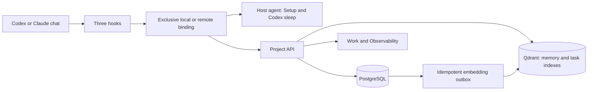

[**EN · English**](architecture.md) · [IT · Italiano](architecture.it.md)

# Architecture

Technical reference for `v0.2.0-beta.1`.

dDuo Solo Founder is a project-isolated operating memory for Codex and Claude
Code. A project can run locally or on an authenticated VPS; its UI is
intentionally small, while the data model remains durable and auditable.

## Beta package architecture

```text
Agent Plugins portable core: plugin.json + skills/ + mcp.json
                            |
Shared runtime: MCP + API + PostgreSQL + Qdrant + dashboard + backup
                            |
              Codex adapter + Claude adapter
```

Agent Plugins 1.0 standardizes Skills and MCP discovery, not the lifecycle
hooks that capture turns and inject context. Codex and Claude Code are the
supported clients; unsupported or mismatched MCP identities are rejected.

Native sources live under `it.dduo.client-support/`. The installer creates
one minimal package per client: Codex receives its manifest, Skill, hooks and
license; Claude receives its manifest, Skill, MCP launcher and license.
Neither registers the portable root a second time. Codex uses the verified
absolute dispatcher; each MCP call still validates its `workspace_root`.

`PLUGIN_ROOT` locates packaged resources. `PLUGIN_DATA` belongs to a client
installation and may disappear on uninstall: it is not authoritative memory
or credential storage. Project data remains in the bound stack and private
project-scoped host directories, shared across supported clients.



## Host control plane

`dduo-agent` is one persistent host-local process. A private token and a
process-start lock prevent concurrent agents from racing. It selects a free
host port, persists it with `0600` permissions, and passes that port to each
project's Docker environment. Requests are accepted only from loopback or a
private container network and still require the scoped bearer; the public VPS
gateway never routes this port. This removes fixed-port collisions without
publishing the host control plane.

The agent owns only host concerns: serial subscription CLI calls, Setup, native
sign-in requests, project-scoped OpenAI and file-backed Codex credentials, and
resuming auth-paused jobs. Docker receives an authenticated host-agent token,
never the provider subscription credential itself. Codex sleep currently pins
`gpt-5.6-terra` with medium reasoning. Its ephemeral run has shell/exec tools
and web search disabled: the model receives only the bounded consolidation
input and structured-output schema, not a tool capable of reading the
file-backed login used by the Codex process itself.

## Project boundary

Each project folder binds a UUID in `.dduo-solo-founder/project.toml`.
A local binding also records its API/Web port pair; a remote binding records
HTTPS endpoints instead. The authoritative host's Compose project owns isolated
PostgreSQL and Qdrant volumes. Every API operation is scoped to the UUID, so
retrieval cannot cross project boundaries. A new project's first authority can
be initialized directly on a Linux VPS, followed by a workstation `remote-bind`;
an existing authority moves through the transfer protocol below.

The canonical root is part of the local authority claim. Commands validate the
registered owner and root before touching project state. Copying a configured
descriptor to another folder cannot create a second writable memory; an
explicit move, restore or remote rebind is required.

A VPS preserves that exact boundary: it runs one complete Compose stack per
project. Multiple stacks may coexist on one server, but the only shared
container is a host-network Caddy gateway. Caddy terminates short-lived ACME
TLS for the public IP and proxies the project's assigned HTTPS port to that
project's loopback-only web port; the web service then proxies `/api` to its own
private API. The first registered project uses port 443 and later projects use
one stable free port from 24443 through 25442. PostgreSQL, Qdrant, API, worker,
web, secrets and backup state are never shared across projects.

The repository descriptor declares exactly one client binding. `local`
contains only loopback ports. `remote` contains only canonical HTTPS API and
dashboard URLs and cannot contain local ports. A remote binding is usable only
after the client has approved the exact repository root, project ID and
endpoint fingerprint. Its bearer lives in a separate `0600` file. A failed
remote request cannot start or query a local fallback stack, preventing a
second accidental memory authority.

PostgreSQL is authoritative. It retains profile revisions, Work, Sprints,
immutable Sprint closure snapshots, artifacts,
raw events, sessions, turns, segments, jobs, memories, revisions, activities,
team identities, device-token hashes, manual revisions, observability events,
backup records, authority generation/state and the embedding outbox. Qdrant contains
separate, project-scoped memory and task collections. Both are derived and
rebuildable; a task search hit is never treated as an authoritative Task row.

## Team and authority boundary

Remote mode requires a bearer or a project-specific browser session for every
route except health and the two one-time exchanges. A bearer identifies one
member and device; only its SHA-256 hash is persisted. A five-minute browser
ticket is exchanged for a seven-day, project-specific `HttpOnly`, `Secure`,
`SameSite=Strict` cookie. Removing a member revokes all of that member's device
and browser credentials.

The two remote capabilities are **Gestore dell'infrastruttura** and **Membro
del progetto**. Both can work with the same project state and inspect team
observability. The trusted local owner has the manager capability before a
project is shared. Only that local owner or the remote manager publishes the
operational manual and creates its compaction draft; remote invitations,
revocation, backups and authority changes remain manager-only.

Authority is an explicit PostgreSQL state machine:

```text
source:      active(N)
               -> transfer_pending(N, target, nonce; ordinary writes rejected)
               -> transferred(N, irreversible after destination-ready receipt)

destination: restored transfer_pending(N, same target and nonce)
               -> destination_ready receipt, still read-only
               -> active(N+1) only with the source-finalized receipt

source:      transfer_pending(N) -> active(N) only when cancelled before finalization
```

The final v2 backup carries the frozen state and generation. Node initialization
and activation additionally require the project authority secret, which is not
given to collaborators. Both handoff receipts are HMAC-bound to the project,
source and target node IDs, frozen generation and one-time nonce. The
destination remains fenced until it receives the source-finalized receipt; the
source persists that proof before deleting its isolated volumes, so cleanup is
retryable after interruption.

This deliberately small protocol assumes both hosts are controlled by the same
trusted infrastructure manager. The authority secret is copied in the encrypted
full-recovery bundle, so receipts prevent accidental overlap and mismatched or
corrupted handoffs, not forgery by a malicious destination that possesses the
shared secret. An untrusted/Byzantine-host model would require asymmetric
source-only signing or an external coordinator.

## Hooks and MCP

| Hook | Responsibility |
| --- | --- |
| `SessionStart` | Start/resume services, replay pending turns and load the briefing. |
| `UserPromptSubmit` | Record an idempotent prompt fragment, extend a steered turn and inject its Founder Brief. |
| `Stop` | Save ordered fragments and final response, stage attributable usage, or spool the turn for retry. |

The bundled Node runner delegates to the same locked runtime as MCP. A
private, non-secret pointer locates executables, including native Windows
`.exe` entry points; dispatch failure emits valid fallback JSON. Node must
remain available to the client. Claude supplies its plugin/project roots
through the native adapter. Codex requires 0.150.0 or newer and uses
`additionalContextLimit=0`, leaving the delivery budget to dDuo; Claude
keeps its own hook schema.

Memory or authentication outages do not block model work. Claude's separate
status-line adapter records numeric usage while preserving any previous
status-line output; it is not a prompt or tool gate.

MCP covers briefing, memory, Work, artifacts, activity and Setup. Every call
requires a canonical absolute `workspace_root`, validated independently of
process `cwd` or previous calls. Claude also pins that root in its environment;
mismatches are rejected. Codex supplies no static project-root environment.
This routing metadata comes from the trusted agent, not immutable client
attestation or a security boundary against the model. Registered roots,
project-scoped authorization and isolated stores enforce project separation.

The automatic briefing is already current: `get_project_briefing` refreshes
it only when needed. `list_tasks` returns compact active cards;
`get_task` reads one row, and `search_tasks` tries exact identity before
semantic search. `activate_task_context` uses the same single-task path.
Use one search to resolve ambiguity, then reuse the selected snapshot.

Full content requires `detail=full`. Lists use `limit` (default 100, maximum
200), `offset` and `total`; traverse every page for a complete inventory.
`scope=completed|all`, `placement=current|backlog|archive|all` and
`sprint_id` are independent filters. Exact reads remain available across
views. `known_snapshot_hash` can return `unchanged` only while the caller
still holds that snapshot; after compaction, read it again without the hash.

The versioned operational manual is required in full session snapshots and
is not repeated in unchanged deltas. An explicit head-and-tail excerpt points
to `get_project_manual` when needed. The manager-only compaction endpoint
returns an unpublished draft of at most 4,000 characters, using the sleep
executor or a deterministic fallback. Publication through dashboard or
`update_project_manual` requires a direct request or confirmed proposal,
optimistic concurrency and idempotency.

For remote outages, an authenticated live response can seed a private,
HMAC-authenticated manual cache bound to the exact project, checkout and
device bearer. Only network failures or server 5xx permit this explicitly
stale fallback. Authorization failures and incompatible clients never do.
Memories, Work and a replacement authority are not cached locally.

## Founder Brief composition

`SessionStart` and `UserPromptSubmit` use one deterministic composer with a
hard ceiling of 9,000 client-safe units. SessionStart emits a full snapshot on
startup, clear and native compaction; resume emits a delta when its baseline is
trusted and otherwise fails safe to a full snapshot. UserPromptSubmit emits
relevant memories plus only changed foundation/Work and explicitly requested
Work not delivered earlier. A unit is the greater of Python Unicode
code points and JavaScript-style UTF-16 code units for the final string. This
keeps astral characters such as emoji from making a payload valid on the server
but oversized in a JavaScript client.

Project, manual, Plan and task state is delivered once while a live model context can
reuse it; later prompts receive dynamic or changed context. A private,
versioned per-session baseline records only what the composer actually emitted.
Missing, corrupt, incompatible or unknown-session state fails safe to another
full snapshot. The baseline advances only after hook output is flushed, and no
decision relies on provider cache behavior. Native compaction
can invoke `SessionStart` again for the same external session. A byte-identical
brief is then intentional rehydration of the compacted context, with a distinct
delivery identity in observability, not a reason to omit the payload.

The wire format is JSON Lines. Every fragment and the final `_dduo_context`
manifest are complete JSON values; no string or JSON object is cut to make it
fit. Fragments have a stable priority and input order tie-breaker. Required
operating/health/profile context comes first, followed by relevant Plans and
Tasks, exact/direct/history-fallback memories, then lower-priority summary and
navigation state. Duplicate memory IDs are removed before composition. The
composer selects a priority prefix rather than filling spare space with a less
important lower-ranked fragment.

A fragment is `full`, `partial`, or `omitted`. `partial` is possible only when
the caller supplied an explicit valid excerpt; the composer never manufactures
one by slicing the source. Memory excerpts preserve ID, type, key and revision,
mark themselves as excerpted, and point to `explain_memory` for full text and
provenance. If required context cannot fit even through its explicit excerpt,
the hook emits a small valid fallback manifest instead of malformed context.

Memory candidate generation is current-first. The direct current-prompt search
runs before any historical query. Recent session prompts are consulted only for
an Italian or English elliptical request, or when a successful direct search
qualifies no active memory; a failed direct provider/vector operation is not
immediately retried as history. Raw scores are never fused. PostgreSQL filters
active actionable rows, keeps the latest revision for each type/key and
deduplicates them; exact ID or node-key references sort before semantic hits.
There is no fixed output K and no per-type cap. Qdrant's top-48 limit bounds only
candidate generation, while the Founder Brief budget bounds delivery.

## Work and failures

Work remains shallow: `Epic -> Task`, with free-form labels and optional
attachments. Epics belong to the whole project and can span Sprints; only Tasks
have an optional `sprint_id`. Sprint placement and execution status are separate.

| Work view | Authoritative population |
| --- | --- |
| Current Sprint | Tasks assigned to the single active Sprint. Planned Sprints can be selected explicitly. |
| Backlog | Unfinished Tasks with no Sprint, including `in_progress` and `blocked` tasks. |
| History / Archive | Archived Sprint closures and legacy unsprinted `done` or `cancelled` tasks. |
| All work | Project-wide access, with explicit filters and pagination. |

A Sprint starts as `planned`; at most one per project can be `active`.
Creating or starting one does not assign existing Tasks, and changing a Task's
status does not assign or move it. With no active Sprint, the dashboard's current
view shows Backlog; the automatic briefing uses unfinished unsprinted Work.
With an active Sprint, the briefing selects its unfinished Tasks. The bounded
briefing is a current-work sample, not a complete Work inventory.

Closure first reads `preview_sprint_close`, then requires the displayed
`expected_version`, an `idempotency_key`, and an explicit destination for
unfinished work: Backlog or another planned Sprint. One transaction archives
the Sprint, stores immutable compact task snapshots and outcomes, and moves
unfinished Tasks while preserving their status. Any intervening task edit
invalidates the preview. Retrying the same mutation returns its receipt;
reusing its key for different input is rejected. Archived snapshots retain
their original membership and outcome even when the current Task later changes.
Reopening a Sprint returns it to `planned` without erasing prior closures.
Reopening an archived Task requires an explicit Sprint or Backlog destination.

Legacy completed work stays available without invented historical Sprints.
`create_historical_sprint` groups only an explicitly selected set of unsprinted
`done` or `cancelled` Tasks, with an idempotency key; it does not reconstruct
past execution dates. Completed and superseded Plans remain accessible through
Plan history and exact reads and are excluded from automatic active context.

Plans are separate, versioned design and decision documents. A Plan can remain
unlinked while an approach is open, then link many-to-many to
the Epic and Tasks it informs; it never becomes a third execution level. The
agent receives a planning-aware, task-first instruction rather than a technical
block. An explicit execution request authorizes the minimum supporting Work;
an adjacent initiative or materially new scope gets one compact proposal and
one aggregate confirmation. Broad undecided work belongs in a Plan, clear
execution reuses or creates the appropriate Epic or Task, and brief discussion
or atomic work does not acquire ceremonial structure.

The shared operating contract requires pragmatic, clean, elegant, concise and
precise behavior; best practices are applied proportionately rather than
dogmatically. Material errors, limits, doubts and risks are surfaced, and an
adversarial review is suggested only for important decisions or deliveries.
Model-facing payloads keep stable IDs for routing, while normal prose presents
each Plan, Epic or Task through its human title and exact dashboard deep link.
An ID appears to the user only when explicitly requested or needed for a
technical diagnosis.

Automatic briefings use compact task cards and deterministic counts instead of
embedding complete descriptions, completion evidence, and attachment text in
every turn. A compact card retains identity, status, priority, objective, next
action, labels, due date, Epic/Sprint membership, and version. A working view
adds the task description, rationale, dependencies, attachment references, and
whether completion evidence exists. Only the full view includes complete
evidence and extracted attachment content.
Project, Plan and task briefing state is delivered once per session and
reinjected only when that state changes; later turns keep dynamic memory and
health context. Every automatic delivery still passes through the unified
9,000-unit Founder Brief composer.

Memory, profile, Plans and Work are project state shared by Codex and Claude.
Sleep execution is owned by the project host rather than by the source chat.
The current executor is Codex; pending jobs from either client are normalized
to it, while `source_client` remains as provenance. This creates one durable
backlog and one authentication boundary without changing which clients can read
the consolidated state. A paused job never blocks interactive work.

Turn storage is independent from memory consolidation. If API or Docker calls
fail, a user-only hook state file stores the full pending turn. Replays reuse
the external session and turn IDs, so they are idempotent. The dashboard shows
typed, readable failure states. Raw CLI output, authentication tokens and
provider diagnostics are excluded from those states; the separate context
inspector intentionally exposes the exact project context described below.

## Task semantic projection

Tasks use the existing project Qdrant service in a separate versioned
collection. The deterministic embedding document contains title, objective,
next action, description and labels, bounded by a configurable character
budget and a 7,500-byte UTF-8 ceiling. Status, priority, kind, Epic/Sprint,
source/renderer versions, semantic hash and truncation counts are metadata.
Attachments, completion evidence, revision text and activity are not embedded.

Task mutations commit a versioned `task.upsert` outbox event with the
PostgreSQL revision. Workers reread the current row, reject stale events and
skip paid embeddings when the semantic hash is unchanged; metadata-only
changes update the payload. A per-task advisory lock serializes projections
without locking authoritative task rows during provider latency.

UUID and unique exact-title lookup use PostgreSQL without embeddings. Full
startup reconciliation compares authoritative tasks with Qdrant, queues missing
or stale points, deletes orphans and persists readiness. Restore and explicit
invalidation run the same repair. An unavailable inventory keeps authoritative
tasks queued and semantic requests on bounded lexical fallback.

Before a paid query, search checks the collection epoch marker, exact
cardinality, current-version pending work and PostgreSQL generation. It
rechecks these around the vector call; an overlapping mutation or incomplete
collection discards the result. Full reconciliation also validates identities
and payloads, detecting equal-count substitutions that cardinality cannot.
Short mutations and reconciliation share a project lock, but search latency
holds none.

Every vector hit is rehydrated against current project, version, hash and
placement. A valid below-threshold hit is a normal empty result. Provider or
index failures use bounded PostgreSQL lexical search; exact reads and CRUD
remain available. Fallback never dumps all full tasks into model context.
PostgreSQL wins over stale, orphaned or newer derived points.

## Project observability

`observability_events` is a project-scoped append-only ledger of numeric
measurements, approved metadata, timestamps and identifiers. Optional
`context_event_payloads` retain the exact hook/MCP string, hash, capture time,
producer/renderer versions and component manifest. This inspector content may
contain project information; raw CLI output, authentication material and
unrelated files are excluded. Deleting a project cascades to both tables;
deleting a linked lifecycle row clears its link, not the observation.

Keep these categories independent:

- **Embeddings:** OpenAI-reported usage, duration and an immutable attributable
  price snapshot for each SDK invocation. Internal SDK retries are not separately
  observable. Metadata-only task maintenance has `request_count=0`.
- **Interactive agent:** attributable request usage from Claude's status line
  or Codex Stop, with provider/model and authenticated member when available.
- **Sleep:** each model pass, including usage reported before failure or timeout.
- **Context:** exact delivered characters/bytes and deterministic token estimates,
  not the model's complete prompt or a provider acknowledgement.
- **Reliability:** latency, candidates, selected items, failures and degradation,
  without counting embedding usage twice.

The isolated Codex adapter reads numeric `last_token_usage` records correlated
to the current session/turn. A verified byte cursor limits streaming to that
turn, at most 512 MiB and 1,000 provider requests. Unknown formats, invalid
correlation or exceeded limits make the whole measurement unavailable.
Cumulative snapshots are never priced. A private retry source preserves the
cursor and linkage through temporary file, outbox or process failures; prompt,
response and tool text never enter the agent-usage spool.

Within each provider/model row, keep reported input, derived uncached input,
cache read/write, output and reasoning separate. Cache-hit percentages are
weighted by measured input; no counter identifies exact cached text spans.
Per-request costs apply long-context rates only when that request qualifies.
Claude client-computed estimates may use configured pricing and span
`Mixed/unknown` models. Other API-equivalent estimates require complete usage
and a versioned matching catalog; unknown models remain unpriced.
These estimates are not subscription spending or remaining quota and must not
be added to embedding costs or other categories. See [pricing](pricing.md).

Hooks stage the exact emitted snapshot in their existing retry state; MCP
captures the serialized result immediately before returning it. Founder Brief
events retain candidate/emitted size, included/partial/omitted references and
budget savings. Snapshot, delta and fallback are distinct delivery types.
Previously delivered stable JSONL bytes are context reuse, not provider cache
tokens or budget omissions. `delivery_expectation=inline_expected` describes
the hook contract, not proof that the model consumed the string.

All telemetry writes are best-effort and cannot interrupt normal operations
or durable turn commits. Missing values are `null`; reported zero stays zero.
Summaries expose separate coverage, time buckets and paginated metadata;
the inspector lazily loads exact context and linked turn/retrieval/revision
details. Each actual SessionStart emission has its own occurrence identity,
including intentional identical rehydration; retries reuse it.

Events and payloads are backed up in PostgreSQL but do not themselves mark
the project dirty. There is no historical backfill. Authenticated
`member_id` links usage and Work revisions causally; background and older
unattributed data appear as **System / legacy**. Every authorized member sees
the shared project ledger, not a separate personal memory.

For recovery and remote topology, see [Backup and recovery](backup-and-recovery.md)
and [Remote projects and teams](remote-teams.md).
